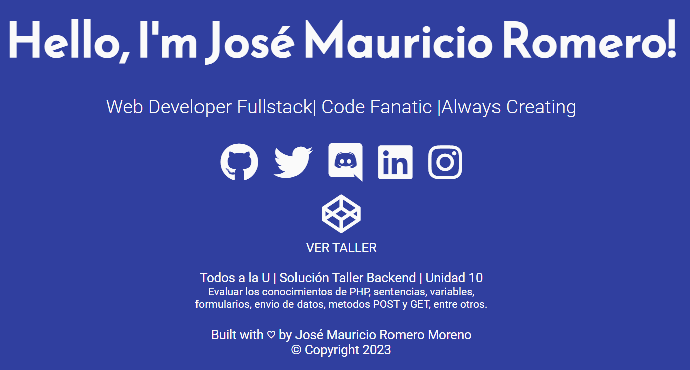
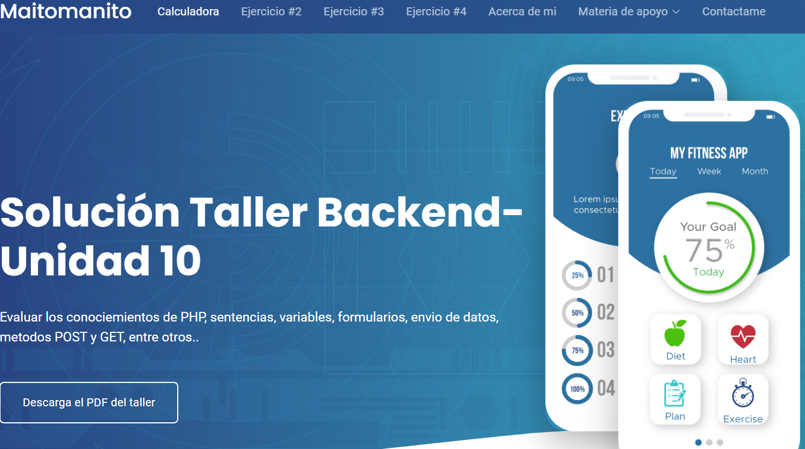
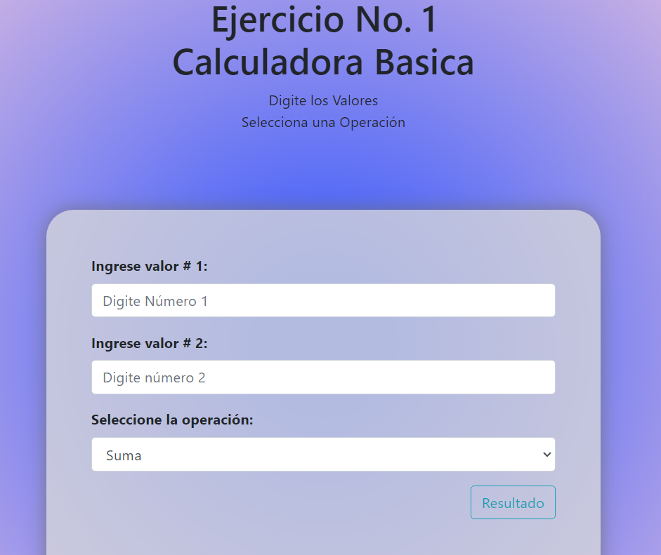
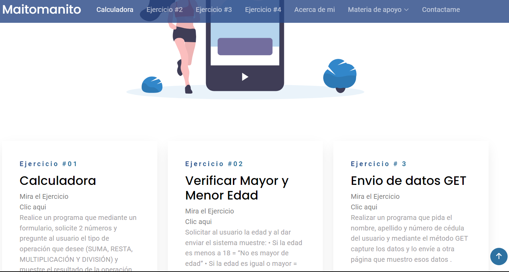

<div align="center">
  
  <br />
  <br />
  
  

  <h2 align="center">Todos a la U | Solución Taller Backend | Unidad 10</h2>

  Evaluar los conocimientos de PHP, sentencias, variables,
f
 <br />Formularios, envio de datos, metodos POST y GET, entre otros. lenguaje base PHP

  <a href="https://github.com/Maitomanito"><strong>➥ Live Demo</strong></a>

</div>

<br />

### Demo Screeshots





### Prerequisites

Before you begin, ensure you have met the following requirements:

* [Git](https://github.com/Maitomanito/ejercicio_10_proyectobackend_main"Download Git") must be installed on your operating system.

### Installing Micro

To install **Micro**, run this command on your git bash:

Linux and macOS:

```bash
sudo git clone https://github.com/Maitomanito
```

Windows:

```bash
git clone https://github.com/Maitomanito
```

### Contact

If you want to contact with me you can reach me at [Twitter](https://www.twitter.com/donmaurom).

### License

This project is **free to use** and does not contains any license.
